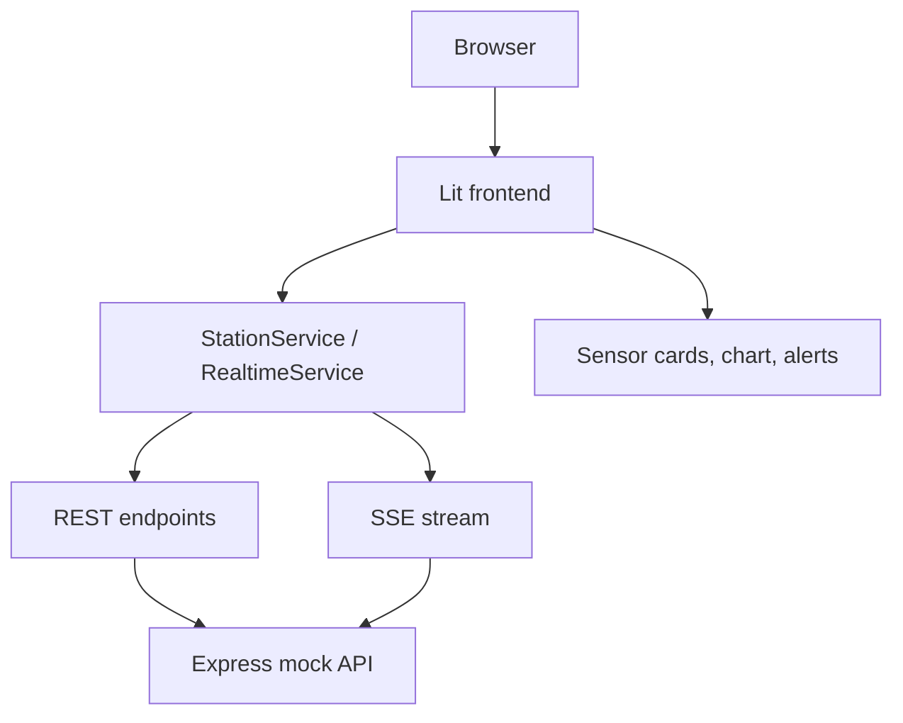

# HydroMonitor Lab

[](https://github.com/Balbib99/HydroMonitor-Lab/actions/workflows/ci.yml)

HydroMonitor Lab is an independent educational environmental monitoring dashboard for simulated HydroMet-style station data. It is a frontend-focused portfolio project built with Lit, TypeScript, REST, Server-Sent Events, Chart.js, automated testing, GitHub Actions CI, and Vercel deployment.

HydroMonitor Lab is not a KISTERS product and does not reproduce KISTERS internal software, architecture, infrastructure, or proprietary data.

[Live Demo](https://hydromonitor-lab.vercel.app) | [Source Code](https://github.com/Balbib99/HydroMonitor-Lab)

## Live Demo

Production: https://hydromonitor-lab.vercel.app

The public demo lets you try station selection, current measurements, a historical water-level chart, realtime updates through Server-Sent Events, threshold-based alerts, and a responsive desktop/mobile layout.

The backend and data are simulated for an educational demo. This project does not represent real HydroMet production infrastructure.

## Project Overview

HydroMonitor Lab simulates a technical monitoring dashboard for hydrological and environmental stations. The application loads station snapshots through REST, listens for realtime telemetry through SSE, renders historical measurements, and evaluates threshold-based alarms in the browser.

The project is intentionally scoped as a clear frontend software development demonstration: component design, typed domain models, service boundaries, async request handling, user-visible states, testing, CI, and deployment.

## Features

- Station selection
- Realtime sensor measurements
- Historical time-series visualization
- Threshold-based alarm engine
- Loading, error, and empty states
- `AbortController` handling for stale requests
- Responsive desktop/mobile layout
- Accessibility basics with semantic HTML, native controls, focus styles, live regions, and chart summary text
- Jest coverage for isolated logic and services
- Cypress E2E coverage for browser-level flows
- GitHub Actions Continuous Integration
- Public Vercel deployment

## Tech Stack

| Area | Technologies |
| --- | --- |
| Frontend | Lit, TypeScript, Vite, Web Components, Chart.js |
| Backend / Data simulation | Express, REST, Server-Sent Events |
| Testing | Jest, Cypress |
| CI / Deployment | GitHub Actions, Vercel |

## Architecture



## REST + Realtime

REST is used for the station list, station details, latest measurements, and historical measurement ranges.

SSE is used for server-to-client realtime telemetry, where the simulated backend pushes new measurements to the browser.

Available API endpoints:

| Method | Endpoint |
| --- | --- |
| GET | `/api/stations` |
| GET | `/api/stations/:id` |
| GET | `/api/stations/:id/measurements/latest` |
| GET | `/api/stations/:id/measurements` |
| GET | `/api/stations/:id/measurements/stream` |

## Data Flow

```text
REST snapshot
  -> Lit state
  -> sensor cards + chart

SSE
  -> new measurement
  -> current value + historical series
  -> alarm evaluation
```

## Alarm Engine

The alarm engine is based on pure functions and `AlarmRule` definitions. Measurements are evaluated against configured thresholds, alarm IDs are deterministic for deduplication, and the application keeps only a recent alarm window.

## Testing

Jest covers isolated logic and services. Cypress covers complete user-visible flows, responsive behavior, realtime updates, and basic accessibility assertions.

Current validation:

- Jest: 21 tests
- Cypress: 13 E2E tests

## Continuous Integration

GitHub Actions runs Continuous Integration on pushes and pull requests targeting `main`.

The workflow has two jobs:

- `quality`: installs dependencies with `npm ci`, builds the project, and runs Jest.
- `e2e`: runs after `quality` and executes the Cypress E2E suite.

CI validates changes automatically. It is not Continuous Deployment: GitHub Actions does not deploy HydroMonitor Lab automatically in this project.

More details: [docs/ci.md](docs/ci.md)

## Deployment

Production: https://hydromonitor-lab.vercel.app

Local development runs the frontend and API as separate processes:

```text
Browser
  -> Vite :5173
  -> Express :3001
```

Production runs on Vercel using the deployed frontend and same-origin API routes:

```text
Browser
  -> Vercel
     -> Vite/Lit frontend
     -> /api -> Express
```

`VITE_API_BASE_URL` can be used to point the frontend to another API if needed. In production, when it is not set, the frontend defaults to same-origin `/api`.

More details: [docs/deployment.md](docs/deployment.md)

## Performance Considerations

The frontend keeps a bounded recent history with `MAX_POINTS`, requests limited time ranges, and updates the existing Chart.js instance instead of recreating it. Production-scale datasets would need server-side aggregation, downsampling, cache-aware range loading, and possibly Web Workers or Canvas/WebGL-specific rendering strategies.

More details: [docs/performance.md](docs/performance.md)

## Accessibility

The UI uses semantic HTML, native controls, visible focus styles, text plus color for states, live connection/alert regions, and a textual chart summary for assistive technologies.

This is not a full WCAG audit.

More details: [docs/accessibility.md](docs/accessibility.md)

## Getting Started

```bash
git clone https://github.com/Balbib99/HydroMonitor-Lab.git
cd HydroMonitor-Lab
npm install
```

For a reproducible install that follows `package-lock.json` exactly, use:

```bash
npm ci
```

Run the frontend and mock API together:

```bash
npm run dev:all
```

Local URLs:

```text
Frontend: http://localhost:5173
API:      http://localhost:3001
```

## Available Scripts

| Script | Purpose |
| --- | --- |
| `npm run dev` | Starts the Vite frontend on port 5173. |
| `npm run mock-server` | Starts the local Express simulation API. |
| `npm run dev:all` | Starts frontend and mock API together. |
| `npm run build` | Runs TypeScript and creates a production build. |
| `npm test` | Runs Jest tests. |
| `npm run test:coverage` | Runs Jest with coverage output. |
| `npm run test:e2e` | Starts the app stack and runs Cypress E2E tests. |
| `npm run cypress:open` | Opens Cypress interactively. |
| `npm run cypress:run` | Runs Cypress headlessly. |

## Project Structure

```text
src/             frontend components, models, services, utilities, and tests
mock-server/     local Express simulation backend
api/             Vercel serverless API entry point
cypress/         E2E specs, fixtures, and support
docs/            project notes for CI, deployment, performance, accessibility, and demo
.github/         GitHub Actions workflow
```

## Technical Decisions

- Lit and Web Components keep UI pieces reusable and framework-light.
- Services isolate REST and SSE transport from rendering.
- REST loads snapshots and history; SSE handles realtime telemetry.
- `AbortController` prevents stale station requests from updating the UI.
- The alarm engine uses pure functions for predictable tests.
- State updates are immutable so Lit reactivity stays explicit.
- Jest and Cypress split fast logic tests from browser-flow validation.
- GitHub Actions validates build, unit tests, and E2E tests automatically.
- Vercel serves the frontend and exposes the simulated Express API through `/api`.

## Known Limitations

- The backend is a mock backend.
- Sensor data is simulated.
- Data is not persisted.
- SSE state is generated in memory.
- Robust recovery of realtime gaps is not implemented.
- A production downsampling pipeline is not implemented.
- Accessibility improvements are included, but there has been no full WCAG audit.

## Future Improvements

- Add persistent backend/data storage.
- Recover gaps after realtime stream interruptions.
- Add backend aggregation and downsampling.
- Add richer accessibility testing.
- Add production observability.

## Screenshot

The repository is prepared for a dashboard screenshot at `docs/images/dashboard.png`. The image is not referenced here until a real screenshot exists.
