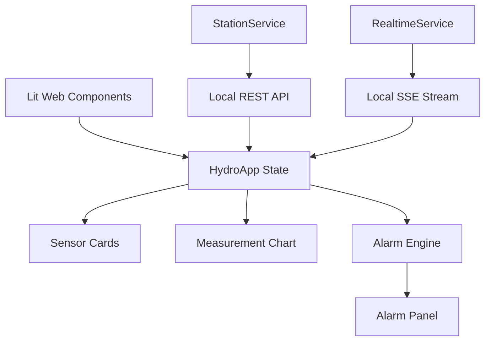

# HydroMonitor Lab

[](https://github.com/Balbib99/HydroMonitor-Lab/actions/workflows/ci.yml)

A frontend monitoring dashboard for simulated hydrological and environmental station data, built to explore modern frontend patterns for data-oriented applications.

HydroMonitor Lab is an independent educational project inspired by publicly available requirements for HydroMet-oriented frontend development. It is not a KISTERS product and does not reproduce internal KISTERS software, architecture, or proprietary data.

Repository: https://github.com/Balbib99/HydroMonitor-Lab

## Project Overview

HydroMonitor Lab simulates a technical monitoring dashboard for HydroMet-style stations. It loads station data through REST, keeps current readings updated through Server-Sent Events, renders historical measurements, evaluates threshold-based alarms, and includes automated tests for logic and browser flows.

## Features

- Station selection
- Current sensor readings
- Historical time series
- REST data loading
- Realtime SSE updates
- Threshold-based alarms
- Loading and error states
- Responsive dashboard UI
- Accessibility considerations

## Tech Stack

Frontend:

- TypeScript
- Lit
- Web Components
- Chart.js

Backend simulation:

- Node
- Express

Testing:

- Jest
- Cypress

Engineering:

- Vite
- GitHub Actions

## Architecture



## REST + Realtime

REST is used for the initial station list, latest measurement, and historical measurement range.

SSE is used for server-to-client realtime telemetry, where the mock server pushes new measurements to the browser.

Available local endpoints:

| Method | Endpoint |
| --- | --- |
| GET | `/api/stations` |
| GET | `/api/stations/:id` |
| GET | `/api/stations/:id/measurements/latest` |
| GET | `/api/stations/:id/measurements` |
| GET | `/api/stations/:id/measurements/stream` |

These endpoints are part of the simulated local API.

## Data Flow

```text
REST snapshot
  -> Lit state
  -> sensor cards + chart

SSE
  -> new measurement
  -> current value + historical series
  -> alarm evaluation
```

## Alarm Engine

The alarm engine is based on pure functions and `AlarmRule` definitions. Measurements are evaluated against configured thresholds, alarm IDs are deterministic for deduplication, and the application keeps only a recent alarm window.

## Testing

Jest covers isolated logic and services. Cypress covers browser-level user flows, responsive behavior, realtime updates, and basic accessibility assertions.

Current local validation:

- Jest: 21 tests
- Cypress: 13 E2E tests

## Continuous Integration

GitHub Actions runs Continuous Integration on pushes and pull requests targeting `main`.

The `quality` job runs:

- `npm ci`
- `npm run build`
- `npm test`

The `e2e` job runs after `quality`:

- `npm ci`
- `npm run test:e2e`

More details: [docs/ci.md](docs/ci.md)

## Performance Considerations

The frontend keeps a bounded recent history with `MAX_POINTS`, requests limited time ranges, and updates the existing Chart.js instance instead of recreating it. Production-scale datasets would need server-side aggregation, downsampling, cache-aware range loading, and possibly Web Workers or Canvas/WebGL-specific rendering strategies.

More details: [docs/performance.md](docs/performance.md)

## Accessibility

The UI uses semantic HTML, native controls, visible focus styles, text plus color for states, live connection/alert regions, and a textual chart summary for assistive technologies.

This is not a full WCAG audit.

More details: [docs/accessibility.md](docs/accessibility.md)

## Getting Started

```bash
git clone https://github.com/Balbib99/HydroMonitor-Lab.git
cd HydroMonitor-Lab
npm install
```

For a reproducible install that follows `package-lock.json` exactly, use:

```bash
npm ci
```

Run the frontend and mock API together:

```bash
npm run dev:all
```

Frontend:

```text
http://localhost:5173
```

API:

```text
http://localhost:3001
```

## Available Scripts

| Script | Purpose |
| --- | --- |
| `npm run dev` | Starts the Vite frontend on port 5173. |
| `npm run mock-server` | Starts the local Express simulation API. |
| `npm run dev:all` | Starts frontend and mock API together. |
| `npm run build` | Runs TypeScript and creates a production build. |
| `npm test` | Runs Jest tests. |
| `npm run test:coverage` | Runs Jest with coverage output. |
| `npm run test:e2e` | Starts the app stack and runs Cypress E2E tests. |
| `npm run cypress:open` | Opens Cypress interactively. |
| `npm run cypress:run` | Runs Cypress headlessly. |

## Project Structure

```text
src/             frontend components, models, services, utilities, and tests
mock-server/     local Express simulation backend
cypress/         E2E specs, fixtures, and support
docs/            project notes for CI, performance, accessibility, and demo
.github/         GitHub Actions workflow
```

## Technical Decisions

- Lit and Web Components keep UI pieces reusable and framework-light.
- Services isolate REST and SSE transport from rendering.
- REST loads snapshots and history; SSE handles realtime telemetry.
- `AbortController` prevents stale station requests from updating the UI.
- The alarm engine uses pure functions for predictable tests.
- State updates are immutable so Lit reactivity stays explicit.
- Jest and Cypress split fast logic tests from browser-flow validation.
- GitHub Actions validates build, unit tests, and E2E tests automatically.

## Known Limitations

- The backend is a local mock server.
- Data is not persisted.
- SSE gap recovery after reconnect is not implemented.
- Production-scale downsampling is documented but not implemented.
- Accessibility has not been fully audited.
- Thresholds and measurements are simulated.

## Future Improvements

- Recover gaps with REST after SSE reconnects.
- Add user-selectable time ranges.
- Add server aggregation and downsampling.
- Introduce persistent storage.
- Add richer accessibility testing.
- Use the [Lit to Angular comparison](docs/angular-vs-lit.md) as interview preparation material.

## Screenshot

The repository is prepared for a dashboard screenshot at `docs/images/dashboard.png`. The image is not referenced here until a real screenshot exists.
